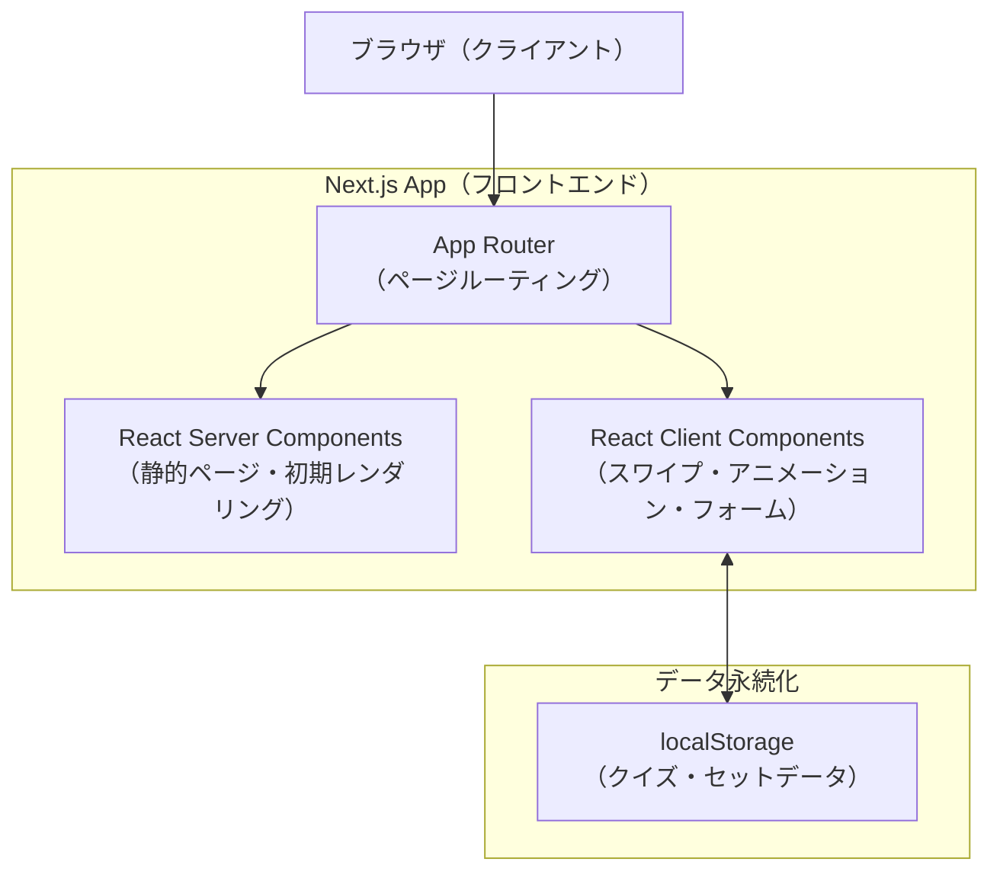

# 技術仕様書

## テクノロジースタック

### フロントエンド

| 用途 | 技術 | バージョン | 採用理由 |
|---|---|---|---|
| フレームワーク | Next.js (App Router) | 15.x | React Server Components対応・ファイルベースルーティング |
| 言語 | TypeScript | 5.x | 型安全性・IDE補完による開発効率 |
| スタイリング | Tailwind CSS | 4.x | ユーティリティファーストで高速なUI実装 |
| アニメーション | Framer Motion | 11.x | スワイプジェスチャー・キャラクターアニメーションに特化 |
| フォント | Noto Sans JP（Google Fonts） | - | 日本語対応・可読性が高くゲームUIに自然に馴染む |

**Tailwind CSS v4 の注意点：**

Tailwind CSS v4はv3と設定方法が大きく異なる。

- `tailwind.config.js` は不要（廃止）
- CSSファイルで `@import "tailwindcss"` と記述するだけで有効化
- カスタムカラー・フォントは `@theme` ブロックでCSS変数として定義する

### データ永続化

| 用途 | 技術 | 採用理由 |
|---|---|---|
| クイズデータ保存 | localStorage | バックエンド不要のMVP構成。ブラウザネイティブAPIでシンプル |

### 開発ツール

| 用途 | 技術 | バージョン |
|---|---|---|
| パッケージマネージャー | npm | Next.js同梱 |
| リンター | ESLint | Next.js同梱 |
| フォーマッター | Prettier | - |
| 型チェック | tsc (TypeScript Compiler) | - |

---

## システム構成図



**設計方針：**
- スワイプ操作・Framer Motionアニメーション・フォーム入力はすべて `'use client'` のClient Componentで実装
- トップ画面・管理画面トップなど静的に近いページはServer Componentを活用してバンドルサイズを削減
- localStorageアクセスはカスタムフック（`useQuizStore`）に集約し、各コンポーネントから直接触らない

---

## 技術的制約と要件

### Next.js App Router の制約

| 制約 | 対応方針 |
|---|---|
| Server ComponentではlocalStorageにアクセス不可 | データアクセスはすべてClient Component・カスタムフック内で行う |
| `'use client'` はファイル単位で宣言 | インタラクティブな要素は専用のClient Componentに切り出す |
| ページ間でのstateの受け渡し | `AnswerRecord[]` は `sessionStorage` に一時保存してリザルト画面で読み込む。プレイ画面離脱時に削除する |

### Framer Motion の利用方針

| 機能 | 実装方法 |
|---|---|
| スワイプカード | `motion.div` に `drag="x"` + `dragConstraints` を設定し、`onDragEnd` で閾値判定 |
| カードの傾き | `useMotionValue` で drag量を取得し `useTransform` で回転角に線形補間 |
| カードの吹き飛び | `onDragEnd` 確定後に `animate` でスワイプ方向へ飛ばし、`AnimatePresence` の `exit` で消える |
| キャラクター表情切り替え | `AnimatePresence` + `variants` で状態に応じた切り替え |

### localStorage の制約

| 制約 | 対応方針 |
|---|---|
| 容量制限（5MB程度） | テキストデータのみ保存するため実用上問題なし |
| SSR時に `window` が未定義 | `useEffect` 内またはClient Componentでのみアクセス |
| データ破損・未初期化 | 読み込み時にバリデーションとフォールバックを行う |

---

## パフォーマンス要件

| 指標 | 目標値 | 対応方針 |
|---|---|---|
| スワイプアニメーション | 60fps以上 | Framer MotionのGPUアクセラレーション（`transform`・`opacity`のみ変更） |
| 初期表示（LCP） | 2秒以内 | Server Componentによる初期HTML配信、フォントのプリロード |
| クイズ読み込み | 即時（0ms） | localStorage読み込みは同期APIのため遅延なし |

---

## ディレクトリ構成（概要）

詳細は `repository-structure.md` を参照。

`src/` ディレクトリを **使用する**（`create-next-app` のデフォルト選択肢に従う）。

```text
src/
├── app/                 # Next.js App Router ページ
├── components/          # 再利用可能なUIコンポーネント
├── hooks/               # カスタムフック（useQuizStore など）
├── lib/                 # ユーティリティ・ヘルパー関数
├── types/               # TypeScript型定義
└── data/                # 初期サンプルデータ
```

---

## 状態管理方針

外部状態管理ライブラリ（Zustand・Jotaiなど）は使用しない。
以下の方針でシンプルに管理する。

| データ種別 | 管理方法 | 理由 |
|---|---|---|
| クイズ・セットデータ | `useQuizStore` カスタムフック + localStorage | アプリ全体で共有・永続化が必要 |
| プレイセッション（AnswerRecord[]） | プレイ画面の `useState` + ページ遷移時に `sessionStorage` へ書き出し | 揮発データだがページ間受け渡しが必要 |
| スワイプ状態（Idle/Dragging/Feedback） | `SwipeCard` 内の `useState` | コンポーネントローカルな状態 |
| キャラクター表情 | 親コンポーネントからpropsで渡す | 単方向データフローを維持 |

### `useQuizStore` インターフェース概要

```typescript
function useQuizStore() {
  return {
    // データ
    quizzes: Quiz[];
    sets: QuizSet[];

    // セット操作
    addSet: (set: Omit<QuizSet, 'id' | 'createdAt' | 'updatedAt'>) => void;
    updateSet: (id: string, updates: Partial<QuizSet>) => void;
    deleteSet: (id: string) => void;   // 配下のクイズも連鎖削除

    // クイズ操作
    addQuiz: (quiz: Omit<Quiz, 'id' | 'createdAt' | 'updatedAt'>) => void;
    updateQuiz: (id: string, updates: Partial<Quiz>) => void;
    deleteQuiz: (id: string) => void;

    // セット内クイズ取得
    getQuizzesBySetId: (setId: string) => Quiz[];
  };
}
```

**共有方法：** `useQuizStore` は内部で `useState` + `useEffect`（localStorage同期）を持つ。
複数コンポーネントから同一データを参照する場合は React Context でラップして共有する（`QuizStoreProvider`）。

---

## セキュリティ方針

- ユーザー入力（クイズの問題文・選択肢）は表示時にReactのデフォルトエスケープに委ねる（`dangerouslySetInnerHTML` は使用しない）
- localStorageのデータ読み込み時にJSONパースエラーを適切にハンドリングする
- 管理画面には認証を設けない（MVP段階。ローカル利用を想定）
