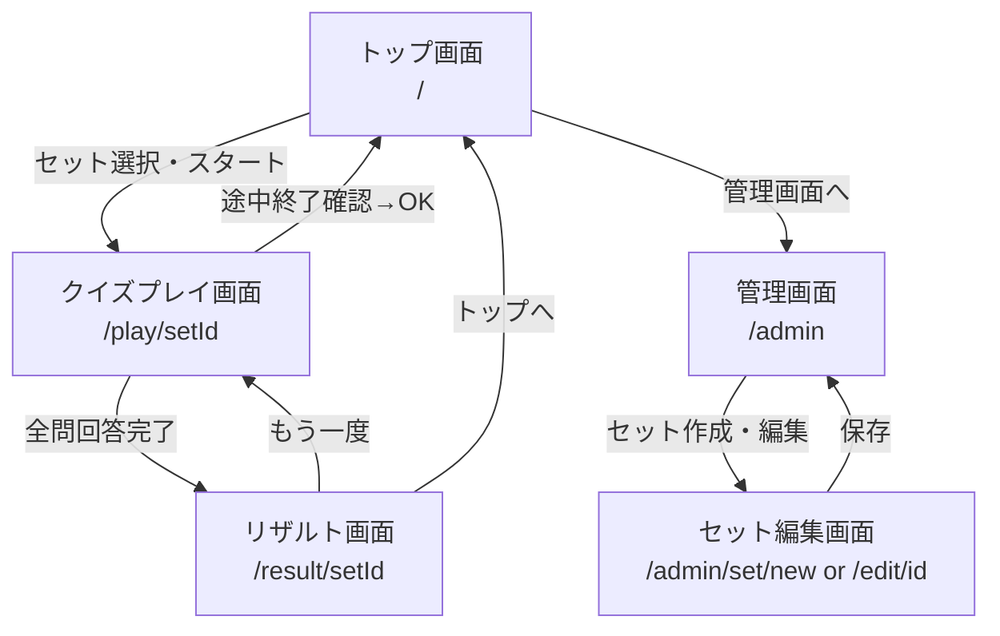
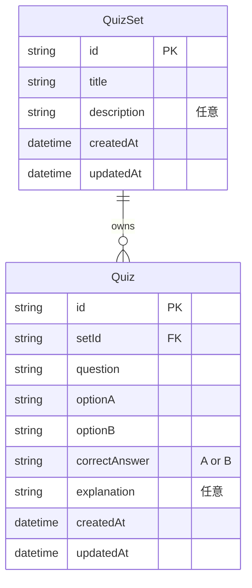
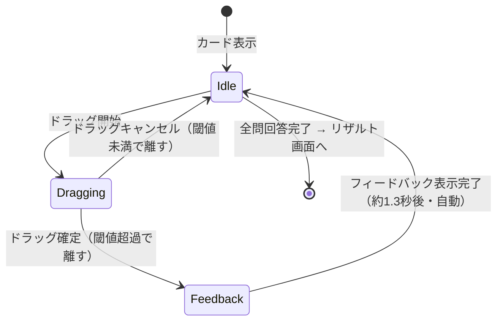
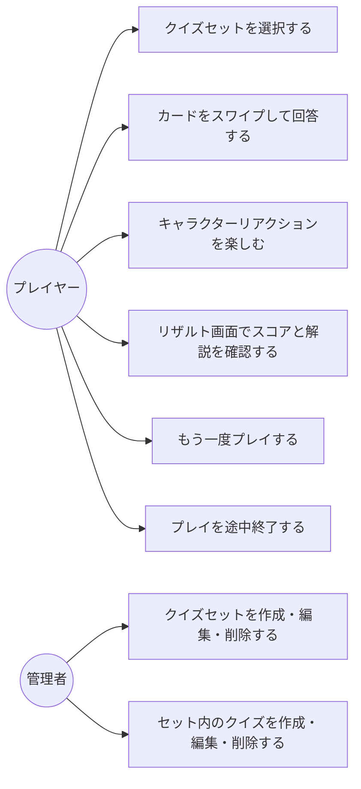

# 機能設計書

## 画面遷移図



---

## ワイヤフレーム

### トップ画面（/）

```
┌─────────────────────────────┐
│  🎯 スワイプクイズ           │
│                             │
│  ┌─────────────────────┐    │
│  │  セットタイトル      │    │
│  │  10問               │    │
│  │           [スタート] │    │
│  └─────────────────────┘    │
│                             │
│  ┌─────────────────────┐    │
│  │  セットタイトル      │    │
│  │  5問                │    │
│  │           [スタート] │    │
│  └─────────────────────┘    │
│                             │
│              [管理画面へ →] │
└─────────────────────────────┘
```

### クイズプレイ画面（/play/[setId]）

```
┌─────────────────────────────┐
│  3 / 10          [×終了]   │
│                             │
│  ┌──────────────────────┐   │
│  │  (キャラクター)       │   │
│  │    (ハラハラ顔)       │   │
│  └──────────────────────┘   │
│                             │
│  ← [選択肢A]  [選択肢B] →  │
│  （ドラッグで滲む色で強調）  │
│                             │
│  ╔══════════════════════╗   │
│  ║  (次の問題・背後)    ║   │
│  ╠══════════════════════╣   │
│  ║                      ║   │
│  ║     問題文がここに   ║   │
│  ║     表示されます     ║   │
│  ║                      ║   │
│  ╚══════════════════════╝   │
└─────────────────────────────┘
```

**選択肢の左右配置ルール：**

- 左スワイプ → 選択肢A を選択
- 右スワイプ → 選択肢B を選択
- クイズ作成時に選択肢A・Bの順序を意図して設定する（ランダム配置はしない）
- カード上の左右に常に選択肢A・Bのラベルを表示し、どちらがどちらか一目でわかるようにする

### クイズプレイ画面 ─ 回答フィードバック表示

```
┌─────────────────────────────┐
│  3 / 10                     │
│                             │
│  ┌──────────────────────┐   │
│  │  (キャラクター)       │   │
│  │    (大喜び顔)         │   │  ← 正解なら大喜び / 不正解ならガックリ
│  └──────────────────────┘   │
│                             │
│         ✅ 正解！           │  ← カード中央にオーバーレイ表示
│       （1秒後に自動で次へ）  │
│                             │
│  ╔══════════════════════╗   │
│  ║  (飛び去るカード残像) ║   │
│  ╚══════════════════════╝   │
└─────────────────────────────┘
```

**回答後UXフロー（時系列）：**

```
スワイプ確定（指を離す）
    ↓ 即時（0ms）
カードが選択方向へ吹き飛ぶアニメーション開始（300ms）
    ↓
✅ 正解 / ❌ 不正解 のオーバーレイがカード中央にフェードイン（200ms）
キャラクターが正解/不正解の表情へ切り替わる（200ms）
    ↓
フィードバック表示を維持（800ms）
    ↓ 自動で次へ（合計約1.3秒後）
次のカードがスタックから手前にスライドイン（300ms）
キャラクターが idle へ戻る
```

※ 解説はこのフローには登場しない。全問回答後のリザルト画面でまとめて表示。

### クイズプレイ画面 ─ 途中終了確認ダイアログ

「×終了」ボタンをタップすると確認ダイアログを表示する。

```
┌─────────────────────────────┐
│  ╔═══════════════════════╗  │
│  ║  プレイを終了しますか？ ║  │
│  ║                       ║  │
│  ║  途中の結果は保存      ║  │
│  ║  されません            ║  │
│  ║                       ║  │
│  ║  [キャンセル] [終了]   ║  │
│  ╚═══════════════════════╝  │
└─────────────────────────────┘
```

- **キャンセル**: ダイアログを閉じてプレイ再開
- **終了**: リザルトを表示せずトップ画面へ戻る

### リザルト画面（/result/[setId]）

```
┌─────────────────────────────┐
│  結果                        │
│                             │
│  ┌──────────────────────┐   │
│  │  (キャラクター)       │   │
│  │  （スコアに応じた表情）│   │
│  └──────────────────────┘   │
│                             │
│       7 / 10 正解           │
│          70%                │
│                             │
│  ─── 問題の振り返り ────   │
│                             │
│  Q1 ✅ 問題文...           │
│     あなた: 選択肢A（テキスト）
│     正解  : 選択肢A（テキスト）
│     解説  : ...             │
│                             │
│  Q2 ❌ 問題文...           │
│     あなた: 選択肢A（テキスト）
│     正解  : 選択肢B（テキスト）
│     解説  : ...             │
│                             │
│  [もう一度]  [トップへ]     │
└─────────────────────────────┘
```

**リザルト画面のキャラクター表情（正答率ベース）：**

| 正答率 | キャラクター表情 |
|---|---|
| 100% | `perfect`（特別な喜び演出） |
| 70%以上 | `correct`（大喜び） |
| 40〜69% | `idle`（穏やか） |
| 39%以下 | `low_score`（少し落ち込む） |

### 管理画面（/admin）

管理画面は **クイズセット一覧のみ** のシンプルな構成。
クイズはセットに属し、セット編集画面でインラインに管理する。

```
┌─────────────────────────────┐
│  管理画面          [← 戻る] │
│                             │
│  ┌─────────────────────┐    │
│  │  セット名    5問     │    │
│  │  [編集]    [削除]    │    │
│  └─────────────────────┘    │
│                             │
│  ┌─────────────────────┐    │
│  │  セット名    3問     │    │
│  │  [編集]    [削除]    │    │
│  └─────────────────────┘    │
│                             │
│  [+ セット追加]             │
└─────────────────────────────┘
```

**クイズとセットの関係：**

- クイズは必ず1つのセットに属する（セット未所属のクイズは存在しない）
- クイズの作成・編集・削除はすべてセット編集画面から行う
- セットを削除すると、そのセットに属するクイズもすべて削除される

### セット編集画面（/admin/set/new, /admin/set/[id]/edit）

セットのメタ情報編集 + クイズのインライン管理を1画面で完結させる。

```text
┌─────────────────────────────┐
│  セット編集        [← 戻る] │
│                             │
│  セットタイトル             │
│  ┌─────────────────────┐    │
│  │ （テキスト入力）     │    │
│  └─────────────────────┘    │
│                             │
│  説明（任意）               │
│  ┌─────────────────────┐    │
│  │ （テキストエリア）   │    │
│  └─────────────────────┘    │
│                             │
│  ── クイズ ───────────────  │
│  ┌─────────────────────┐    │
│  │  Q1. 問題文...       │    │
│  │         [編集] [削除]│    │
│  └─────────────────────┘    │
│  ┌─────────────────────┐    │
│  │  Q2. 問題文...       │    │
│  │         [編集] [削除]│    │
│  └─────────────────────┘    │
│  [+ クイズを追加]           │
│                             │
│              [保存する]     │
└─────────────────────────────┘
```

「+ クイズを追加」または「編集」を押すと、クイズ入力フォームがモーダルで開く。

### クイズ入力モーダル

```text
┌─────────────────────────────┐
│  ╔═══════════════════════╗  │
│  ║  クイズを追加    [×] ║  │
│  ║                       ║  │
│  ║  問題文               ║  │
│  ║  ┌─────────────────┐  ║  │
│  ║  │（テキストエリア）│  ║  │
│  ║  └─────────────────┘  ║  │
│  ║                       ║  │
│  ║  選択肢A（← 左）      ║  │
│  ║  ┌─────────────────┐  ║  │
│  ║  │（テキスト入力）  │  ║  │
│  ║  └─────────────────┘  ║  │
│  ║                       ║  │
│  ║  選択肢B（右 →）      ║  │
│  ║  ┌─────────────────┐  ║  │
│  ║  │（テキスト入力）  │  ║  │
│  ║  └─────────────────┘  ║  │
│  ║                       ║  │
│  ║  正解                 ║  │
│  ║  ( ) 選択肢A  ( ) B  ║  │
│  ║                       ║  │
│  ║  解説（任意）         ║  │
│  ║  ┌─────────────────┐  ║  │
│  ║  │（テキストエリア）│  ║  │
│  ║  └─────────────────┘  ║  │
│  ║                       ║  │
│  ║  [キャンセル] [保存]  ║  │
│  ╚═══════════════════════╝  │
└─────────────────────────────┘
```

---

## データモデル定義



### TypeScript型定義

```typescript
type CorrectAnswer = 'A' | 'B';

interface Quiz {
  id: string;
  setId: string;       // 必須：必ず1つのセットに属する
  question: string;
  optionA: string;
  optionB: string;
  correctAnswer: CorrectAnswer;
  explanation?: string;
  createdAt: string;
  updatedAt: string;
}

interface QuizSet {
  id: string;
  title: string;
  description?: string;
  createdAt: string;
  updatedAt: string;
}

// プレイセッション中の回答履歴（メモリ上のみ・リザルト表示用）
interface AnswerRecord {
  quiz: Quiz;              // リザルト表示のためQuizオブジェクトをスナップショットとして保持
  selectedAnswer: CorrectAnswer;
  isCorrect: boolean;
}
```

**`AnswerRecord` の設計方針：**

- `quizId` のみの参照ではなく、`Quiz` オブジェクト全体をスナップショットとして保持する
- 理由：リザルト画面で問題文・選択肢テキスト・解説を表示するために、プレイ中にクイズが編集・削除されても表示が壊れないようにするため

---

## localStorageデータ設計

```typescript
// キー設計
const STORAGE_KEYS = {
  QUIZZES: 'swipe-quiz:quizzes',   // Quiz[] を JSON 文字列で保存（setIdで絞り込み）
  SETS: 'swipe-quiz:sets',         // QuizSet[] を JSON 文字列で保存
} as const;

// 保存形式
localStorage.setItem('swipe-quiz:quizzes', JSON.stringify(quizzes));
localStorage.setItem('swipe-quiz:sets', JSON.stringify(sets));

// セットに属するクイズの取得例
const quizzesForSet = (quizzes: Quiz[], setId: string) =>
  quizzes.filter(q => q.setId === setId);
```

**データ管理の方針：**

- アプリ初回起動時にサンプルデータを自動投入する（空の状態でもプレイ体験できるように）
- `AnswerRecord` はlocalStorageに保存しない（プレイセッションの揮発データ）

---

## コンポーネント設計

### コンポーネントツリー

```text
app/
├── page.tsx                    # トップ画面
├── play/[setId]/
│   └── page.tsx                # クイズプレイ画面
├── result/[setId]/
│   └── page.tsx                # リザルト画面（AnswerRecordをstate経由で受け取る）
└── admin/
    ├── page.tsx                # 管理トップ（セット一覧）
    └── set/
        ├── new/page.tsx        # セット作成（クイズのインライン追加含む）
        └── [id]/edit/page.tsx  # セット編集（クイズのインライン編集含む）

components/
├── quiz/
│   ├── SwipeCard.tsx           # スワイプ可能なカード（Framer Motion使用）
│   ├── CardStack.tsx           # カードのスタック表示
│   └── ChoiceIndicator.tsx     # 左右の選択肢ラベル（ドラッグ量で強調）
├── character/
│   ├── Character.tsx           # キャラクターコンポーネント（stateをpropsで受け取る）
│   └── CharacterFace.tsx       # 表情SVGの切り替え
├── result/
│   ├── ScoreSummary.tsx        # スコアサマリー（正解数・正答率・キャラクター）
│   └── ReviewCard.tsx          # 問題振り返りカード（1問分）
└── admin/
    ├── SetList.tsx             # セット一覧
    ├── SetForm.tsx             # セット編集フォーム（タイトル・説明）
    ├── QuizList.tsx            # セット内クイズ一覧（インライン表示）
    ├── QuizModal.tsx           # クイズ追加・編集モーダル
    └── QuizForm.tsx            # クイズ入力フォーム（QuizModal内で使用）
```

---

## スワイプロジック設計

### 状態遷移



### スワイプ閾値・ビジュアル

| 状態 | 条件 | カードの傾き | 背景演出 | キャラクター |
|---|---|---|---|---|
| Idle | 未操作 | 0° | なし | `idle` |
| Dragging（左） | drag中 | -15°まで線形 | 左端に赤みが滲む | `thinking` |
| Dragging（右） | drag中 | +15°まで線形 | 右端に青みが滲む | `thinking` |
| 確定（正解） | 閾値超過・離す | 吹き飛ぶ | ✅オーバーレイ | `correct` |
| 確定（不正解） | 閾値超過・離す | 吹き飛ぶ | ❌オーバーレイ | `incorrect` |

**スワイプ閾値**: 画面幅の30%

### 操作フォールバック（タップ）

スワイプが困難なユーザー向けに、カード左右の選択肢ラベルをタップして選択できるボタンとしても機能させる。

---

## キャラクター設計

### 表情ステート

| ステート名 | 表示タイミング | 表現 |
|---|---|---|
| `idle` | 未操作・待機中 | 穏やかな笑顔 |
| `thinking` | ドラッグ操作中 | 目が大きくなりハラハラした表情 |
| `correct` | 正解確定後（フィードバック中） | 両手を上げて大喜び |
| `incorrect` | 不正解確定後（フィードバック中） | ガックリ・うなだれる |
| `perfect` | リザルト（正答率100%） | 特別な喜び演出 |
| `low_score` | リザルト（正答率39%以下） | 少し落ち込んだ表情 |

### 実装方針

- Framer Motionで状態切り替えアニメーションを実装
- シンプルな円形ベースのSVGキャラクター（実装コストを抑える）
- 状態切り替えはpropsで制御（`CharacterState` 型）

---

## ユースケース図


